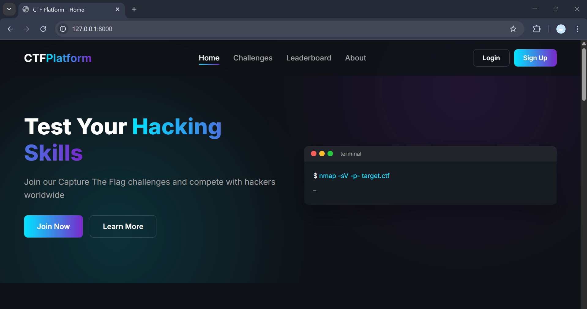

# Django Project Setup Guide

This repository contains a Django project. Follow the instructions below to set up and run the project locally.




---

## 🧰 Prerequisites

Make sure you have the following installed:

- Python 3.8 or higher
- pip
- virtualenv (optional but recommended)
- Git

---

## 🚀 Installation

### 1. Clone the repository

```bash
git clone https://github.com/SoufianeMoussaoui/CTF.git
cd projetfinalCtf
```

### 2. Create and activate a virtual environment

```bash
python -m venv venv
source venv/bin/activate       # On Windows: venv\Scripts\activate
```

### 3. Install dependencies

```bash
pip install -r requirements.txt
```

### 4. Apply database migrations

```bash
python manage.py migrate
```

### 5. Create a superuser (optional)

```bash
python manage.py createsuperuser
```

### 6. Run the development server

```bash
python manage.py runserver
```

Open your browser at http://127.0.0.1:8000 to view the project.

---

## 🧪 Running Tests

Run tests using:

```bash
python manage.py test
```

---

## ⚙️ Configuration

Update settings in `CTF/settings.py` as needed. Use `.env` for environment variables if using `django-environ` or similar tools.

---

## 📁 Project Structure

```
projetfinalCtf/
├── manage.py
├──projetfinalCtf/
│   ├── __init__.py
│   ├── settings.py
│   ├── urls.py
│   └── wsgi.py
├── CTF/
│   └── ...
├── templates/
├── static/
├── requirements.txt
└── README.md
└── conftest.py
```

---

## 📄 License

This project is licensed under the MIT License.
